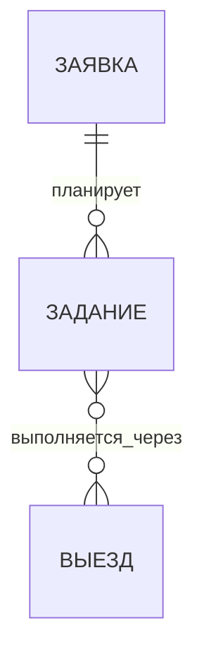

# Диспетчер: заявка → задание ↔ выезд

## Каноническая модель

В бизнес-модели три сущности. Вспомогательные строки работ, связки заданий с выездами, история и распределения затрат — таблицы учёта, а не дополнительные бизнес-сущности.

Зафиксированы кардинальности: задание ссылается ровно на одну заявку; выезд и задание связаны многие-ко-многим. Конкретные правила синхронизации, распределения затрат, прав и склада ниже — проектные предложения, а не утверждённая реализация.

- **Заявка (`jobs`)** принадлежит клиенту и описывает потребность, заявителя, технику, исходное место, желаемый объём и срок. До планирования у черновика может не быть заданий; запланированная заявка должна иметь хотя бы одно.
- **Задание (`service_orders`)** всегда относится ровно к одной заявке. Оно задаёт исполнимый объём работ и материалов, команду, ответственного, даты и способ выполнения. Задание может выполняться без выезда или через несколько выездов.
- **Выезд (`trips`)** хранит маршрут, транспорт, трек, факт километража и поездочные затраты. Он может включать задания из разных заявок. Связь с заданием — многие-ко-многим через таблицу участия выезда в заданиях. Прямая связь выезда с заявкой не является источником истины: заявку можно получить через задания.

Канбан заявок остаётся основной воронкой; дочерние задания раскрываются в заявке. Отдельный канбан заданий нужен для диспетчеризации. Выезд показывает маршрут, хронологию и включённые задания. Завершение выезда не закрывает задание или заявку.

## Владение данными и наследование

| Данные | Канонический владелец | Как их видит связанная сущность |
| --- | --- | --- |
| Клиент, контакт, техника, исходный адрес, описание потребности, SLA | Заявка | Задание показывает контекст заявки по `job_id`; маршрут выезда получает точки через включённые задания |
| Описание потребности и, если известен, измеримый объём | Заявка | Задание ссылается на заявку; измеримые части можно связать с устойчивыми строками потребности |
| Назначенный объём, план работ/материалов, исполнитель, ответственный, рабочие даты и режим | Задание | Заявка показывает сумму/статусы своих заданий; выезд использует только выбранные задания и их точки |
| Маршрут, последовательность остановок, автомобиль, GPS-трек, факт километража, поездочные затраты | Выезд | Факт труда и поездочные затраты распределяются на включённые задания; сводка заявки агрегирует их через задания |
| Комментарий, фото, изменение статуса, предложение правки | Сущность, к которой относится событие | В истории каждой сущности показываются её события; связанное событие можно открыть в исходном контексте |

Один факт хранится в одном месте. В дочерней сущности не создаётся независимая копия редактируемого значения. Для выполнения задания сохраняется снимок ключевого контекста заявки и ревизия источника; он объясняет, по каким адресу, объёму и сроку диспетчер назначил работу. Снимок не заменяет текущие данные заявки.

### Поток изменений

1. **Создание задания:** диспетчер выбирает одну заявку. Контекст клиента, техники, контакта и исходного места подставляется из неё. Объём работ уточняется в задании; при наличии структурированных строк потребности указывается, какую их часть задание покрывает.
2. **Изменение заявки до назначения:** задание показывает актуальные данные заявки. При назначении сохраняется снимок и ревизия.
3. **Изменение заявки после назначения:** изменение описания или контакта отражается в текущем контексте и истории. Изменение объёма, SLA, техники или места помечает связанные задания как требующие проверки куратора. План и маршрут не переписываются молча. Куратор явно принимает обновление в каждом затронутом задании и, если нужно, перестраивает выезд.
4. **Изменение задания:** план, материалы, сроки и команда меняются только в задании. Они не переписывают заявку. Если обнаружена дополнительная потребность, она оформляется предложением изменения заявки и после согласования получает собственную строку потребности.
5. **Связь с выездом:** диспетчер добавляет одно или несколько выездных заданий в выезд. Связка фиксирует участие; остановка допускает несколько заданий, а распределение времени и затрат хранит отдельное основание. Данные заявки в выезде разрешаются через задания.
6. **Факт выезда:** трек, стоянки, километраж и факт поездки остаются у выезда. Утверждённые стоянки и участки трека создают распределения факта на задания. Они не копируют и не затирают план задания.

После начала или закрытия задания/выезда исходный снимок и события неизменяемы. Исправление оформляется новой ревизией или согласованным событием с автором и причиной.

## Объём работ и материалы

Заявка описывает потребность текстом и, когда это возможно, измеримыми строками. Задание конкретизирует план, факт фиксируется отдельно. Для сверки с измеримым объёмом нужны устойчивые ID строк потребности; пересоздаваемые `job_works` для этой роли не подходят.

Если потребность измерима, её строка хранит устойчивый ID, наименование, единицу, количество и при необходимости оценку. Строка задания может ссылаться на неё и хранит собственные план и факт. Превышение согласованной количественной границы требует явной правки заявки; для первоначально неопределённой потребности нельзя требовать численного равенства. Перенос остатка сохраняет происхождение и не засчитывает выполнение дважды.

Каталог материалов общий. Строка материала задания хранит ссылку на каталог, если она есть, и снимок названия, артикула, единицы, количества, цены и себестоимости на дату назначения/использования. Обновление каталога не меняет закрытые задания; новая цена становится действующей только после явного подтверждения.

### Склад во вкладке каталога

В каталоге есть подразделы «Работы», «Техника» и «Склад». Первый складской срез — справочник номенклатуры; физические остатки и резерв остаются отдельным этапом, детали которого ещё не согласованы.

- Карточка номенклатуры хранит стабильный ID, уникальный артикул (если он есть), название, базовую единицу, действующие цену и себестоимость, активность и дату изменения. Варианты единиц/упаковок и коэффициент пересчёта задаются явно.
- Если появится учёт остатков, его основа — журнал движений по явно указанным местам хранения: приход, перемещение со склада сотруднику/в автомобиль, фактический расход, возврат, инвентаризационная корректировка. Выдача перемещает запас между местами хранения; подтверждённый расход уменьшает общий физический остаток **один раз**. Резерв при необходимости ведётся отдельно и не является расходом.
- Плановый материал в задании сам по себе не резервирует склад, пока механизм резерва не согласован. Перед запуском остатков надо определить места хранения, момент признания расхода, единицы измерения, правила отрицательных остатков и начальные остатки по инвентаризации.
- Шаблонная работа предлагает материалы из склада по ID номенклатуры; её рецептура больше не должна быть списком произвольных названий в JSON. В задании каждая строка хранит неизменяемый снимок единицы и цены. При новом выборе система предупреждает об изменении карточки склада и предлагает отдельно обновить справочник.

Таблица `stock_catalog` создана в production миграцией `20260923154823`; все 23 старые строки `job_parts` импортированы по одной через `legacy_part_id` без объединения повторных SKU. На последней проверке каталог содержал 23 позиции; `job_parts` остаются неизменными финансовыми снимками, связанными с заявками. Вкладка «Склад» опубликована и проверена. PR #67 добавил к `service_order_items` тип строки, ID позиции каталога и снимки SKU/цены/себестоимости; новая позиция получает значения активного каталога, а повторное сохранение сохраняет прежний финансовый снимок. Перенос остатка сохраняет снимок, а отдельная регрессия теперь проверяет также прямую заявку и отказ от неоднозначного переноса. `work_catalog.materials` пока остаётся JSON; подтверждаемое обновление каталога ещё предстоит реализовать. Физические остатки и движения не ведутся. Начальный остаток нельзя выводить из старых строк расхода.

## Сотрудники и оргструктура

`profiles` содержит ID учётной записи приложения, имя, контакт, глобальную роль и активность; на эти ID завязаны назначения и проверки доступа. Таблица `employee_org` поверх `profiles.id` уже хранит должность и прямого руководителя, сохраняя их идентичность и действующие RLS. Отдельная личность сотрудника понадобится, только если нужно учитывать людей без учётной записи или смену аккаунта при сохранении кадровой истории.

- **Подразделение и должность:** справочники с историей назначений профиля, прямым руководителем и сроками действия. Для активного назначения руководитель должен определяться однозначно; цепь руководителей не должна содержать циклов.
- **Участие в сущности:** владелец, куратор и несколько исполнителей для заявки, задания и выезда с автором и временем назначения; исполнитель задания и экипаж выезда — разные назначения. В первой версии ссылки ведут на существующие профили.
- **Сотрудник без доступа:** если такой сценарий нужен, вводится отдельная кадровая запись с уникальной необязательной связью с профилем и явным правилом переноса действующих назначений. Это ещё не выбранный вариант.

Права входа и глобальные полномочия остаются у активной учётной записи. Оргсвязь сама по себе не выдаёт доступ: операции проверяют глобальное полномочие и назначение на конкретную сущность. При выбытии владельца автоматическая передача допустима лишь активному руководителю, имеющему право владеть этим элементом; иначе фиксируется ожидающая передача, которую разрешает уполномоченный куратор/администратор. Самостоятельное редактирование своей оргсвязи не должно расширять права.

Подразделения, должности и руководителей нужно загрузить из подтверждённой оргструктуры; в текущей схеме этих данных нет. Отдельный кадровый ID не следует автоматически вводить всем пользователям без подтверждённой потребности.

Технический слой `employee_org` поверх `profiles.id` хранит должность и прямого руководителя. Новые профили автоматически получают пустую запись; при миграции три текущих профиля перенесены без выдумывания должностей и руководителей. PR #65 добавил управление ими в настройках «Сотрудники и роли»; CI и production deploy прошли. Руководитель должен быть активным пользователем, самоназначение и циклы запрещены. Передача владельца при выбытии, кадровая история и назначения владельца/куратора/исполнителей пока не реализованы.

## Статусы и сводка

У заявки, задания и выезда собственные состояния и история:

- заявка: черновик → запланирована → в работе → на проверке → закрыта или отменена;
- задание: черновик → запланировано → в работе → на проверке → закрыто или отменено;
- выезд: черновик → запланирован → в работе → на проверке → закрыт или отменён.

Запуск выезда меняет статус выезда; завершение выезда не завершает задание. У каждой сущности свой сохраняемый статус и собственное подтверждение перехода. Рядом со статусом заявки выводится **отдельный вычисляемый прогресс** её заданий и связанных выездов. Для закрытия заявки предлагается проверять отсутствие незавершённых заданий, для закрытия задания — отсутствие активных относящихся к нему выездов; при общем выезде проверка должна учитывать все его задания. Автоматически менять статус родителя по статусу потомка нельзя. Точные правила отмены и возврата при общих выездах надо определить до реализации переходов.

Исполнитель запускает работу и отправляет факт/предложения; куратор утверждает факт и правки. Перенос срока, возврат из завершающего статуса и изменение согласованного объёма для исполнителя проходят через запрос на изменение. Куратор может выполнять эти действия самостоятельно. Для пула есть куратор по умолчанию, с делегированием на элемент. У каждой сущности есть владелец, куратор и исполнители. Требование «не ниже модератора» из постановки пока не соответствует существующим ролям `admin` / `logist` / `engineer`: нужно определить точное соответствие полномочий, прежде чем добавлять или переименовывать роль.

## План/факт и экономика

- **Работы и труд:** план принадлежит строкам задания. Подтверждённая стоянка может распределять человеко-часы по заданиям своей заявки, связанным с тем же выездом. Для старых стоянок миграция сохраняет исходное задание и долю 100%; новые доли утверждает куратор. Неизвестный состав экипажа, неподтверждённая стоянка и нераспределённые часы остаются видимыми остатками. Себестоимость труда относится к заданию один раз.
- **Материалы:** план и снимок цены принадлежат заданию; факт расхода подтверждается там же. Экономика заявки агрегирует задания.
- **Транспортная выручка:** нынешний `road_km_by_payer` распределяет маршрутную выручку по плательщикам, не по заданиям. Для экономики заданий потребуется отдельное согласованное распределение этой выручки с сохранением итогов по плательщикам; нельзя принять распределение себестоимости за распределение выручки.
- **Себестоимость километража:** километры и ставка принадлежат выезду. Подтверждённый пробег распределяется по надёжным дорожным/трековым участкам фактического трека. Участок относится к ближайшей следующей подтверждённой остановке, а обратный участок после последней — к последней. Доля нескольких заданий на общей остановке задаётся отдельно. Неизвестная геометрия, отсутствие подтверждённой остановки и разница между треком и одометром дают видимый остаток «не распределено». Сумма строк должна совпасть с себестоимостью фактического пробега; разница округления записывается явно.
- **Фиксированные поездочные расходы** (суточные/ночлег) и ручная корректировка пока остаются нераспределёнными. Это сохраняет сверку и не подменяет отсутствующее правило распределения.
- **Сводки:** задание получает только распределённые на него подтверждённые затраты труда и пробега, а заявка суммирует задания. Распределение себестоимости не меняет маршрутную выручку и не переносит целиком `econ_snapshot.cost` поверх себестоимости задания: снимок может включать труд и материалы, уже учтённые по другим статьям. Любое ручное переопределение сохраняется отдельной нераспределённой строкой с причиной.

Распределения хранят источник, ревизию трека/стоянок, основание, долю, сумму, автора согласования и время. Если длина GPS-трека отличается от проверенного пробега, подтверждённые участки могут служить весами, а общий итог берётся из проверенного пробега; отрезки без надёжной геометрии и неназначенные суммы должны оставаться явно нераспределёнными. Без валидного трека факт не маскируется планом.

## История и интерфейс

История — хронологический журнал событий сущности с автором, временем и снимком до/после: создание, изменение, статус, согласование, комментарий, прикрепление файла, запуск/закрытие выезда, появление/утверждение стоянки, потеря связи и расчёт распределения. Сводка плана и факта строится рядом из канонических строк и утверждённых распределений.

Канбан заявок остаётся основной воронкой. Карточка заявки раскрывает задания; карточка задания — распределённые по нему выезды. Один общий выезд отображается в каждом связанном задании с одним ID и ведёт к одной карточке выезда. История/экономика заявки и задания агрегируются по дочерним данным; выездная карточка показывает транспортный факт и разложение по заданиям. На мобильном сохраняется список со сменой статуса без drag-and-drop.

## Состояние внедрения и переход

На 2026-09-23 уже выпущены `service_orders`, `service_order_items`, `service_order_history`, прямой `service_orders.job_id`, разовая базовая задача для каждой исторической заявки с выездом и связь `trip_service_orders(trip_id, order_id)`. Старые `trips.service_order_id`, `trip_jobs` и `service_order_jobs` сохранены как переходные поля/проекции ради старых клиентов. Распределение подтверждённых стоянок и транспортных затрат по заданиям, оргструктура, каталог и снимки материалов также выпущены.

Оставшиеся шаги миграции:

1. Проинвентаризировать старые `service_orders`, их строки и историю. Унаследованные задания, созданные по одному на выезд, не должны оставаться вторым активным набором заданий поверх базовых по заявке; перенести однозначно относящиеся к заявке строки с сохранением происхождения, а исходные записи оставить доступными для проверки до вывода из использования. Пользовательские задания и уже исполненные строки нельзя механически слить: они требуют отдельной сверки. Общие поля (команда, период, статус) нескольких выездов не становятся автоматически полями единственного задания; история остаётся привязана к источнику. Выезды без `trip_jobs`, стоянки без `job_id` и неоднозначные факты остаются в очереди разрешения.
2. После восстановления инвариантов связей переключить серверные операции, RLS и все экраны поэтапно на новую модель с совместимостью для старых редакторов. Сверять связи, часы, расходы и отсутствие сирот. Лишь после проверки всех клиентов убрать триггеры совместимости `trip_order_parent` / `trip_order_job`, обязательность единственного `trips.service_order_id` и устаревшие связи. Переход статусов старых `jobs` и `service_orders` в новую шкалу требует отдельной карты и проверки исключений.

PR #62 добавил связи «заявка — задание — выезд». PR #63 добавил подтверждаемое распределение стоянок и километров на задания, журнал расчётов, проверку устаревания при изменении факта и сводки затрат в задании и заявке. В production сохранены 18 исторических долей стоянок; автоматических подтверждений расходов нет. PR #65 добавил оргструктуру поверх `profiles`; PR #66 и #67 выпустили каталог и снимки материалов; PR #68 устранил неоднозначный embed заявки. PR #69 (`fa3e85b`) восстановил канонический `job_id` при переносе остатка, исправил синхронизацию старых обновлений `trip_jobs` и запретил молча терять утверждённое распределение стоянок. Production-миграция `20260923205517_restore_task_link_invariants` применена, контрольные агрегаты до/после совпали, GitHub Actions run #311 завершился успешно. На действующем сайте под `admin` подтверждены загрузка сводки и отпечаток сборки `a6559bd`, совпавший с пересчитанным по исходным файлам; системных ошибок приложения в консоли не обнаружено. В сводке остаётся видимое предупреждение: одна заявка числится только в удалённых или отменённых выездах; это существующее состояние данных, исправление связей его не меняло. Суточные, ночлег и ручная корректировка пока видны как нераспределённые. Распределение выручки не менялось. Назначения владельца/куратора/исполнителей и передача при выбытии не реализованы; их полномочия и правила передачи нужно согласовать до миграции.
