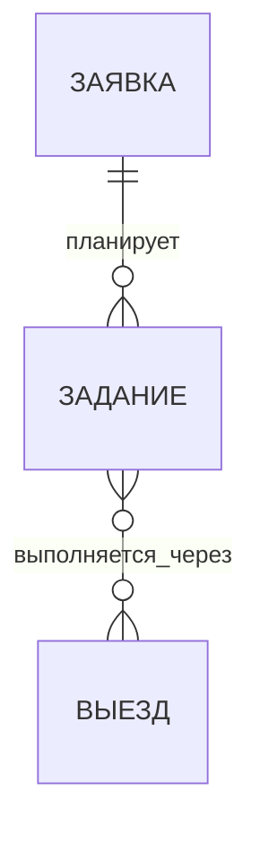

# Диспетчер: заявка → задание ↔ выезд

## Каноническая модель

В бизнес-модели три сущности. Вспомогательные строки работ, связки заданий с выездами, история и распределения затрат — таблицы учёта, а не дополнительные бизнес-сущности.

Зафиксированы кардинальности: задание ссылается ровно на одну заявку; выезд и задание связаны многие-ко-многим. Конкретные правила синхронизации, распределения затрат, прав и склада ниже — проектные предложения, а не утверждённая реализация.

- **Заявка (`jobs`)** принадлежит клиенту и описывает потребность, заявителя, технику, исходное место, желаемый объём и срок. До планирования у черновика может не быть заданий; запланированная заявка должна иметь хотя бы одно.
- **Задание (`service_orders`)** всегда относится ровно к одной заявке. Оно задаёт исполнимый объём работ и материалов, команду, ответственного, даты и способ выполнения. Задание может выполняться без выезда или через несколько выездов.
- **Выезд (`trips`)** хранит маршрут, транспорт, трек, факт километража и поездочные затраты. Он может включать задания из разных заявок. Связь с заданием — многие-ко-многим через таблицу участия выезда в заданиях. Прямая связь выезда с заявкой не является источником истины: заявку можно получить через задания.

Канбан заявок остаётся основной воронкой; дочерние задания раскрываются в заявке. Отдельный канбан заданий нужен для диспетчеризации. Выезд показывает маршрут, хронологию и включённые задания. Завершение выезда не закрывает задание или заявку.

## Владение данными и наследование

| Данные | Канонический владелец | Как их видит связанная сущность |
| --- | --- | --- |
| Клиент, контакт, техника, исходный адрес, описание потребности, SLA | Заявка | Задание показывает контекст заявки по `job_id`; маршрут выезда получает точки через включённые задания |
| Описание потребности и, если известен, измеримый объём | Заявка | Задание ссылается на заявку; измеримые части можно связать с устойчивыми строками потребности |
| Назначенный объём, план работ/материалов, исполнитель, ответственный, рабочие даты и режим | Задание | Заявка показывает сумму/статусы своих заданий; выезд использует только выбранные задания и их точки |
| Маршрут, последовательность остановок, автомобиль, GPS-трек, факт километража, поездочные затраты | Выезд | Факт труда и поездочные затраты распределяются на включённые задания; сводка заявки агрегирует их через задания |
| Комментарий, фото, изменение статуса, предложение правки | Сущность, к которой относится событие | В истории каждой сущности показываются её события; связанное событие можно открыть в исходном контексте |

Один факт хранится в одном месте. В дочерней сущности не создаётся независимая копия редактируемого значения. Для выполнения задания сохраняется снимок ключевого контекста заявки и ревизия источника; он объясняет, по каким адресу, объёму и сроку диспетчер назначил работу. Снимок не заменяет текущие данные заявки.

### Поток изменений

1. **Создание задания:** диспетчер выбирает одну заявку. Контекст клиента, техники, контакта и исходного места подставляется из неё. Объём работ уточняется в задании; при наличии структурированных строк потребности указывается, какую их часть задание покрывает.
2. **Изменение заявки до назначения:** задание показывает актуальные данные заявки. При назначении сохраняется снимок и ревизия.
3. **Изменение заявки после назначения:** изменение описания или контакта отражается в текущем контексте и истории. Изменение объёма, SLA, техники или места помечает связанные задания как требующие проверки куратора. План и маршрут не переписываются молча. Куратор явно принимает обновление в каждом затронутом задании и, если нужно, перестраивает выезд.
4. **Изменение задания:** план, материалы, сроки и команда меняются только в задании. Они не переписывают заявку. Если обнаружена дополнительная потребность, она оформляется предложением изменения заявки и после согласования получает собственную строку потребности.
5. **Связь с выездом:** диспетчер добавляет одно или несколько выездных заданий в выезд. Связка фиксирует участие; остановка допускает несколько заданий, а распределение времени и затрат хранит отдельное основание. Данные заявки в выезде разрешаются через задания.
6. **Факт выезда:** трек, стоянки, километраж и факт поездки остаются у выезда. Утверждённые стоянки и участки трека создают распределения факта на задания. Они не копируют и не затирают план задания.

После начала или закрытия задания/выезда исходный снимок и события неизменяемы. Исправление оформляется новой ревизией или согласованным событием с автором и причиной.

## Объём работ и материалы

Заявка описывает потребность текстом и, когда это возможно, измеримыми строками. Задание конкретизирует план, факт фиксируется отдельно. Для сверки с измеримым объёмом нужны устойчивые ID строк потребности; пересоздаваемые `job_works` для этой роли не подходят.

Если потребность измерима, её строка хранит устойчивый ID, наименование, единицу, количество и при необходимости оценку. Строка задания может ссылаться на неё и хранит собственные план и факт. Превышение согласованной количественной границы требует явной правки заявки; для первоначально неопределённой потребности нельзя требовать численного равенства. Перенос остатка сохраняет происхождение и не засчитывает выполнение дважды.

Каталог материалов общий. Строка материала задания хранит ссылку на каталог, если она есть, и снимок названия, артикула, единицы, количества, цены и себестоимости на дату назначения/использования. Обновление каталога не меняет закрытые задания; новая цена становится действующей только после явного подтверждения.

### Склад во вкладке каталога

В текущем каталоге есть подразделы «Работы» и «Техника»; нужна вкладка «Склад». Первая часть — справочник номенклатуры со снимками в задании, как предложено пользователем. Учёт физических остатков и резерва — отдельный этап, детали которого ещё не согласованы.

- Карточка номенклатуры хранит стабильный ID, уникальный артикул (если он есть), название, базовую единицу, действующие цену и себестоимость, активность и дату изменения. Варианты единиц/упаковок и коэффициент пересчёта задаются явно.
- Если появится учёт остатков, его основа — журнал движений по явно указанным местам хранения: приход, перемещение со склада сотруднику/в автомобиль, фактический расход, возврат, инвентаризационная корректировка. Выдача перемещает запас между местами хранения; подтверждённый расход уменьшает общий физический остаток **один раз**. Резерв при необходимости ведётся отдельно и не является расходом.
- Плановый материал в задании сам по себе не резервирует склад, пока механизм резерва не согласован. Перед запуском остатков надо определить места хранения, момент признания расхода, единицы измерения, правила отрицательных остатков и начальные остатки по инвентаризации.
- Шаблонная работа предлагает материалы из склада по ID номенклатуры; её рецептура больше не должна быть списком произвольных названий в JSON. В задании каждая строка хранит неизменяемый снимок единицы и цены. При новом выборе система предупреждает об изменении карточки склада и предлагает отдельно обновить справочник.

Текущая база хранит предлагаемые материалы шаблона работы в `work_catalog.materials` (JSON) и внесённые запчасти в `job_parts`, привязанных к заявке. Отдельной номенклатуры, остатков и движений склада пока нет. Исторические финансовые строки сохраняются; сопоставление номенклатуры по одному названию может быть неоднозначным и требует проверки. Начальный физический остаток нельзя выводить из старых строк расхода.

## Сотрудники и оргструктура

`profiles` сейчас содержит ID учётной записи приложения, имя, контакт, глобальную роль и активность; на эти ID завязаны назначения и проверки доступа. Сначала следует расширить оргсвязи поверх существующих профилей, сохранив их идентичность и действующие RLS. Отдельная личность сотрудника понадобится, только если нужно учитывать людей без учётной записи или смену аккаунта при сохранении кадровой истории.

- **Подразделение и должность:** справочники с историей назначений профиля, прямым руководителем и сроками действия. Для активного назначения руководитель должен определяться однозначно; цепь руководителей не должна содержать циклов.
- **Участие в сущности:** владелец, куратор и несколько исполнителей для заявки, задания и выезда с автором и временем назначения; исполнитель задания и экипаж выезда — разные назначения. В первой версии ссылки ведут на существующие профили.
- **Сотрудник без доступа:** если такой сценарий нужен, вводится отдельная кадровая запись с уникальной необязательной связью с профилем и явным правилом переноса действующих назначений. Это ещё не выбранный вариант.

Права входа и глобальные полномочия остаются у активной учётной записи. Оргсвязь сама по себе не выдаёт доступ: операции проверяют глобальное полномочие и назначение на конкретную сущность. При выбытии владельца автоматическая передача допустима лишь активному руководителю, имеющему право владеть этим элементом; иначе фиксируется ожидающая передача, которую разрешает уполномоченный куратор/администратор. Самостоятельное редактирование своей оргсвязи не должно расширять права.

Подразделения, должности и руководителей нужно загрузить из подтверждённой оргструктуры; в текущей схеме этих данных нет. Отдельный кадровый ID не следует автоматически вводить всем пользователям без подтверждённой потребности.

## Статусы и сводка

У заявки, задания и выезда собственные состояния и история:

- заявка: черновик → запланирована → в работе → на проверке → закрыта или отменена;
- задание: черновик → запланировано → в работе → на проверке → закрыто или отменено;
- выезд: черновик → запланирован → в работе → на проверке → закрыт или отменён.

Запуск выезда меняет статус выезда; завершение выезда не завершает задание. У каждой сущности свой сохраняемый статус и собственное подтверждение перехода. Рядом со статусом заявки выводится **отдельный вычисляемый прогресс** её заданий и связанных выездов. Для закрытия заявки предлагается проверять отсутствие незавершённых заданий, для закрытия задания — отсутствие активных относящихся к нему выездов; при общем выезде проверка должна учитывать все его задания. Автоматически менять статус родителя по статусу потомка нельзя. Точные правила отмены и возврата при общих выездах надо определить до реализации переходов.

Исполнитель запускает работу и отправляет факт/предложения; куратор утверждает факт и правки. Перенос срока, возврат из завершающего статуса и изменение согласованного объёма для исполнителя проходят через запрос на изменение. Куратор может выполнять эти действия самостоятельно. Для пула есть куратор по умолчанию, с делегированием на элемент. У каждой сущности есть владелец, куратор и исполнители. Требование «не ниже модератора» из постановки пока не соответствует существующим ролям `admin` / `logist` / `engineer`: нужно определить точное соответствие полномочий, прежде чем добавлять или переименовывать роль.

## План/факт и экономика

- **Работы и труд:** план принадлежит строкам задания. Сейчас `trip_stays.job_id` фиксирует заявку, но не задание. Разовый перенос создаёт ровно одно базовое задание для каждой существующей заявки с выездами и тем самым позволяет связать старые стоянки с этим заданием по `job_id`, сохранив их исходные ID, подтверждение и часы. Стоянки без заявки и случаи, где заявке уже соответствуют несколько содержательных заданий, требуют отдельного разрешения. Для нового факта нужны подтверждаемые привязки стоянки к одному или нескольким заданиям с распределёнными человеко-часами. Себестоимость труда относится к заданию один раз.
- **Материалы:** план и снимок цены принадлежат заданию; факт расхода подтверждается там же. Экономика заявки агрегирует задания.
- **Транспортная выручка:** нынешний `road_km_by_payer` распределяет маршрутную выручку по плательщикам, не по заданиям. Для экономики заданий потребуется отдельное согласованное распределение этой выручки с сохранением итогов по плательщикам; нельзя принять распределение себестоимости за распределение выручки.
- **Себестоимость километража:** километры и ставка принадлежат выезду. Предложенный алгоритм: фактический трек делится на участки между подтверждёнными остановками; участок перед обслуживаемой точкой относится к её заданиям, начальный — к первым, обратный — к последним. При общей точке доля заданий определяется подтверждёнными человеко-часами либо явно утверждённой пропорцией. Потери связи, неопределённый адрес или работа без подтверждённой привязки дают видимый остаток «не распределено», а не выдуманное задание. На тестовых треках следует проверить петли, повторные посещения и несовпадение GPS с одометром.
- **Фиксированные поездочные расходы** (суточные/ночлег) требуют отдельной зафиксированной базы распределения; автоматически приравнивать их к километрам нельзя.
- **Сводки:** задание получает только распределённые на него факты выездов и собственные работы/материалы; заявка агрегирует задания. По каждой статье выполняется равенство «сумма по заданиям + не распределено = итог выезда». Текущий `econ_snapshot.cost` уже включает труд, материалы и транспорт, тогда как `perJob` содержит труд и материалы: переносить весь снимок выезда в задания поверх их труда и материалов означало бы удвоить себестоимость. При ручном переопределении общей выручки или себестоимости (`overrides`) расхождение с расчётными компонентами учитывается отдельной корректировкой с причиной, а не теряется в распределении. До замены отчётов нужны отдельные компоненты факта, сверка итогов и сохранение прежних снимков для истории.

Распределения хранят источник, ревизию трека/стоянок, основание, долю, сумму, автора согласования и время. Если длина GPS-трека отличается от проверенного пробега, подтверждённые участки могут служить весами, а общий итог берётся из проверенного пробега; отрезки без надёжной геометрии и неназначенные суммы должны оставаться явно нераспределёнными. Без валидного трека факт не маскируется планом.

## История и интерфейс

История — хронологический журнал событий сущности с автором, временем и снимком до/после: создание, изменение, статус, согласование, комментарий, прикрепление файла, запуск/закрытие выезда, появление/утверждение стоянки, потеря связи и расчёт распределения. Сводка плана и факта строится рядом из канонических строк и утверждённых распределений.

Канбан заявок остаётся основной воронкой. Карточка заявки раскрывает задания; карточка задания — распределённые по нему выезды. Один общий выезд отображается в каждом связанном задании с одним ID и ведёт к одной карточке выезда. История/экономика заявки и задания агрегируются по дочерним данным; выездная карточка показывает транспортный факт и разложение по заданиям. На мобильном сохраняется список со сменой статуса без drag-and-drop.

## Состояние внедрения и переход

Первая поставка уже создала `service_orders`, `service_order_jobs`, `service_order_items`, `service_order_history` и связала каждый существующий выезд ровно с одним заданием через `trips.service_order_id`. Это переходный слой и он расходится с целевой кардинальностью.

Переход выполняется аддитивно:

1. Добавить `service_orders.job_id` и **отдельную** связку `trip_service_orders(trip_id, order_id)`; `service_order_jobs` связывает задание с заявками, а новая таблица — выезд с заданиями, поэтому одно другим заменять напрямую нельзя. Пока старый код работает, сохранить `trips.service_order_id`, `trip_jobs`, `service_order_jobs`, существующие функции и триггеры.
2. Для каждой **существующей заявки с выездом** сформировать одну базовую запись задания: единственным ключом разовой операции служит `job_id`, а повторный запуск не создаёт дубликат. Если заявку обслуживали несколько выездов, они ссылаются на одно базовое задание; если один выезд включал несколько заявок, он связывается с каждым из их базовых заданий. Источник связей — существующие `trip_jobs`, а подтверждённых стоянок — `trip_stays.job_id`. Сохранить ID, время и утверждение стоянки; добавить ссылку на базовое задание и происхождение переноса, не создавать новую стоянку и не начислять стоимость заново.
3. Проинвентаризировать старые `service_orders`, их строки и историю. Унаследованные задания, созданные по одному на выезд, не должны оставаться вторым активным набором заданий поверх базовых по заявке; перенести однозначно относящиеся к заявке строки с сохранением происхождения, а исходные записи оставить доступными для проверки до вывода из использования. Пользовательские задания и уже исполненные строки нельзя механически слить: они требуют отдельной сверки. Общие поля (команда, период, статус) нескольких выездов не становятся автоматически полями единственного задания; история остаётся привязана к источнику. Выезды без `trip_jobs`, стоянки без `job_id` и неоднозначные факты остаются в очереди разрешения.
4. Переключить серверные операции, RLS и все экраны на новую модель с совместимостью для старых редакторов. Проверить создание/изменение выезда, стоянки, права и канбан; сверить количество исходных связей, ссылок на треки, часы, финансовые суммы и отсутствие сирот. Только после проверки убрать автосоздание многозаявочного задания триггером `trip_order_parent` / `trip_order_job`, обязательность единственного `trips.service_order_id` и устаревшие связи. Переход статусов старых `jobs` и `service_orders` в новую шкалу требует отдельной карты и проверки исключений.

Существующие поездочные затраты сейчас хранятся общим снимком выезда; распределение себестоимости километража на задания ещё не реализовано. Сначала нужен расчёт и сверка распределительных строк на характерных треках, включая пропуски GPS и общие остановки, затем миграция подтверждённого факта и переключение экономики. Это не инструкция запускать миграцию или менять действующий сайт по одному только документу.
